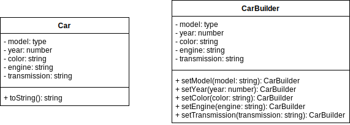

# Builder

## Intent

Separate the construction of a complex object from its representation so that the same construction process can create different representations.

## Applicability

* the algorithm for creating a complex object should be independent of the parts that make up the object and how they're assembled
* the construction process must allow different representations for the object that's constructed
* the construction process must hide the representation and internal structure of the object being built

## Structure

