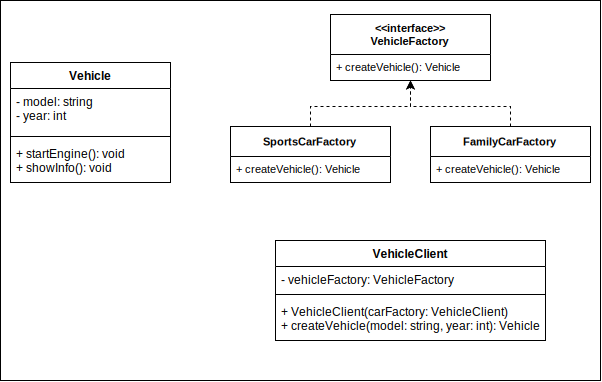

# Factory Method

## Intent

Factory Method is a creational design pattern that provides an interface for creating objects in a superclass, but allows subclasses to alter the type of objects that will be created.

## Applicability

Use the Factory Method pattern when you don’t know beforehand the exact types and dependencies of the objects your code should work with.

The Factory Method pattern suggests that you replace direct object construction calls (using the `new` operator) with calls to a special factory method. Don’t worry: the objects are still created via the `new` operator, but it’s being called from within the factory method. Objects returned by a factory method are often referred to as _products_.

## Pros and Cons

### Pros

- You avoid tight coupling between the creator and the concrete products.
- Single Responsibility Principle. You can move the product creation code into one place in the program, making the code easier to support.
- Open/Closed Principle. You can introduce new types of products into the program without breaking existing client code.
- You can implement the _Open/Closed Principle_ and _Single Responsibility Principle_ at the same time.

### Cons

- The code may become more complicated since you need to introduce a lot of new subclasses to implement the pattern. The best case scenario is when you’re introducing the pattern into an existing hierarchy of creator classes.
- The code may be more confusing since you’re sometimes hiding the code that actually creates the product. This might confuse the developers who work with the creator class or the product subclasses.
- Factory methods are usually called within Template Methods. Subclasses can indirectly override factory methods, which can cause confusion. However, you can avoid this by making the factory method final and provide an overloaded factory method for each variant of the product.

## Relations with Other Patterns

- Many designs start by using _Factory Method_ (less complicated and more customizable via subclasses) and evolve toward _Abstract Factory_, _Prototype_, or _Builder_ (more flexible, but more complicated).
- _Abstract Factory_ classes are often based on a set of _Factory Methods_, but you can also use _Prototype_ to compose the methods on these classes.
- _Factory Method_ is a specialization of _Template Method_. At the same time, a _Factory Method_ may serve as a step in a large _Template Method_.
- _Factory Methods_ are usually called within _Template Methods_.

## Structure

