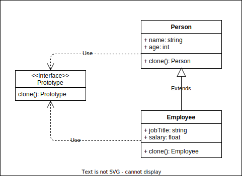

# Prototype

## Intent

Prototype is a creational design pattern that lets you copy existing objects without making your code dependent on their classes.

## Applicability

* Use the Prototype pattern when your code shouldn’t depend on the concrete classes of objects that you need to copy.
  This happens a lot when your code works with objects passed to you from 3rd-party code via some interface.
  The concrete classes of these objects are unknown, and you couldn’t depend on them even if you wanted to.

* Use the pattern when you want to reduce the number of subclasses that only differ in the way they initialize their respective objects.

## Pros and Cons

### Pros

* You can clone objects without coupling to their concrete classes.
* You can get rid of repeated initialization code in favor of cloning pre-built prototypes.
* You can produce complex objects more conveniently.
* You get an alternative to inheritance when dealing with configuration presets for complex objects.

### Cons

* Cloning complex objects that have circular references might be very tricky.
* Cloning objects with lots of nested objects might be tedious.
* Implementing cloning has a hidden cost when your objects contain circular references or links to other objects.
  You need to make sure that you don’t end up in an infinite loop while cloning an object and its children.

## Relations with Other Patterns

* A Prototype isn’t the same as an Abstract Factory.
  Although both patterns allow you to product objects of some class, they do it in different ways.
  An Abstract Factory requires the concrete classes of objects it creates to follow a common interface.
  A Prototype, on the other hand, can produce objects of any class.
  It can even return a value if necessary.
  You can use Prototype with Composite to reduce the number of subclasses even if your classes don’t have a common interface.
* A Prototype factory can be a good alternative to the Singleton pattern.
* A Prototype lets you produce a copy of an object without knowing anything about its type.
  It might come in handy when dealing with 3rd-party code, especially when it’s closed and thus can’t be extended to implement an interface.

## Structure

